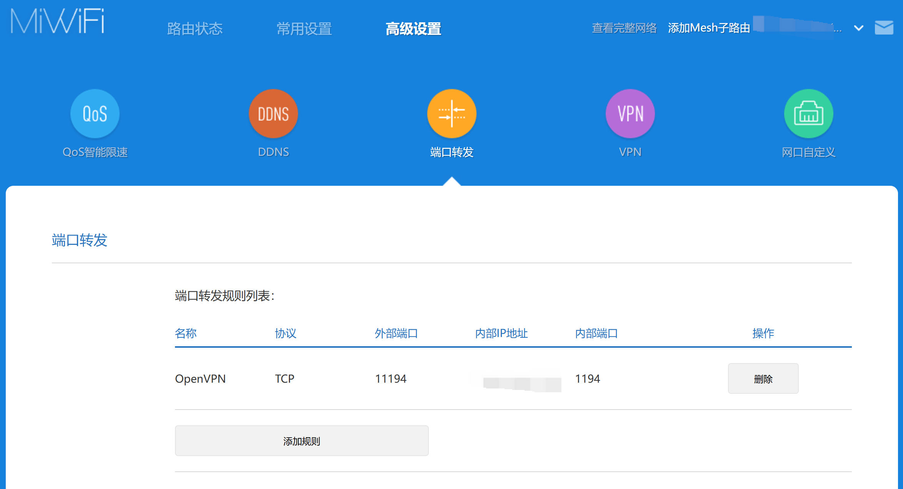

Connect to your home lab from anywhere with OpenVPN

Prerequisites:

- Router has public IPv4/IPv6 address
- Router supports port forwarding

Devices:
- OpenVPN Access Server: Ubuntu 24.04
- OpenVPN Client: Windows 10
- Router: Redmi AX5

1. Install OpenVPN

```bash
bash <(curl -fsS https://packages.openvpn.net/as/install.sh) --yes
```

2. Configure OpenVPN Access Server

Official documentation: https://openvpn.net/as-docs/tutorials/tutorial--configure-access-server.html

- Change default connect port to 1194
- Disable useless features and ports

3. Configure Port Forwarding in Router

Forward TCPUDP port 11194 to OpenVPN Access Server 1194
Redmi router: Advanced settings -> Port forwarding -> Add port forwarding


4. Export OpenVPN Configuration


5. Install OpenVPN Client


6. Add LAN Route to OpenVPN Client Confugration File (Optional)

Sometimes, DNS error may occur when connecting to the OpenVPN server, you can only access LAN IP but not the internet. To solve this problem, you need to add a route to the LAN IP in the OpenVPN client configuration file.

```
# Sample of Redmi router with default IP range
route-nopull
route 192.168.31.0 255.255.255.0 vpn_gateway
```

7. Connect to OpenVPN Server
