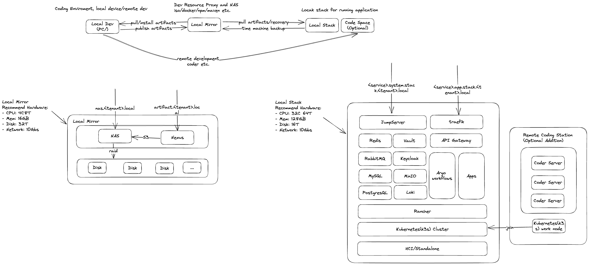

# Local Serial Hardware Products

- Local Mirror: A local mirror of development artifacts and software packages based on the NAS.
- Local Stack: A local stack of development environments with service governance and persistence.
- Local DevBox: A local development environment for coding and testing.

## Local Mirror
Hardware (recommendation):
- CPU: 8 core 16 thread
- RAM: 32GB DDR4
- Storage: 1TB NVMe SSD (OS), 4TB HDD (Data) * 2
- Network: 2.5Gbps Ethernet * 2

Software:
TrueNAS offer s3 service as Nexus blob storage.
- NAS: TrueNAS Core ([Minimum Hardware Requirements](https://www.truenas.com/docs/core/gettingstarted/corehardwareguide/#minimum-hardware-requirements))
    - Processor: 2-Core Intel 64-Bit or AMD x86_64 processor
    - Memory: 8 GB Memory
    - Boot Device: 16 GB SSD boot device
    - Storage: Two identically-sized devices for a single storage pool
- Mirror: Sonatype Nexus Repository
    - CPU: 8 core
    - RAM: 16GB
- System Ops: Nomad
- Firewall: jumpserver

## Local Stack