# Authentication and Authorization System Design

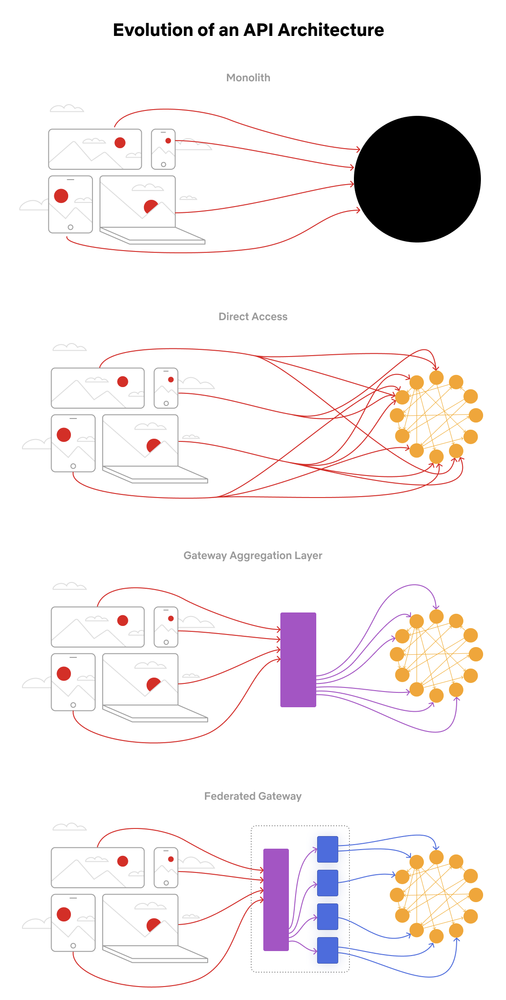

### 需求分析
#### 账户体系支持

业务存在多种账户体系，不同的账户体系对账户管理、认证方式、授权方式各不相同

- 业务用户：机构数据范围内OpenAPI调用，数据在机构间隔离
- 系统用户：运营、运维视角的账户，平台自身管理级别OpenAPI调用，例如许可、机构、客户端软件分发等
- 平台用户：平台级授信，使用一个账户访问对方开放的OpenAPI，例如EDC、XNAT系统集成等

#### 认证协议支持

需要支持多种认证协议，以及认证凭证管理能力

- 认证触发时机差异
- 认证凭证传递安全风险
- 认证凭证定期更新要求
- 已认证会话有效期差异
- 已认证会话主动失效场景差异

#### 链路运维支持

- 认证生命周期日志聚合
- 访问凭证链路传递跟踪
- 认证凭证周期更新
- 认证凭证主动失效

#### IdP & 认证代理

产品涉及多个系统的集成并且需要提供Single Sign-On（SSO）和Single Logout（SLO），提供认证代理集成多个IdP及其对应的认证协议，屏蔽系统间的隔离对用户的感知
<!--  -->
<!--  -->

### 需求目标

- 统一账户体系，业务保留授权主导权
- 统一认证入口，避免多协议认证需求侵入微服务
- 统一密钥管理
- 访问凭证易于传递

## 系统设计

***设计原则：基于JWT，统一认证，分散授权***

- 剥离Resource Server认证功能，统一认证服务，独立迭代拓展
- Resource Server最小化认证集成代价
- JWT无状态，Resource Server易于拓展
- JWT无状态, 易于传递校验
- Resource Server保留鉴权能力，易于实现服务差异化鉴权需求

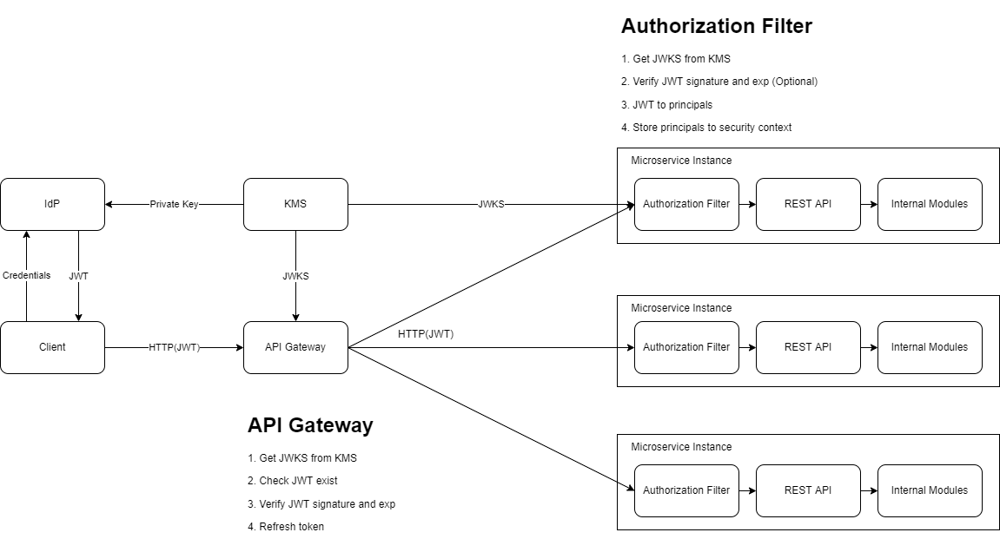

### 组件

| 组件名称        | 描述                                                                  |
| --------------- | --------------------------------------------------------------------- |
| Client          | 访问资源服务器的客户端程序，有可能是浏览器、桌面客户端，或者RPC调用端 |
| IdP             | 用户身份认证，包含认证服务器、授权服务器两个核心特性                  |
| KMS             | 密钥管理服务，可以用来创建和管理您的主密钥                            |
| Resource Server | 资源服务器，受保护数据提供者                                          |
| APIGateway      | API网关                                                               |

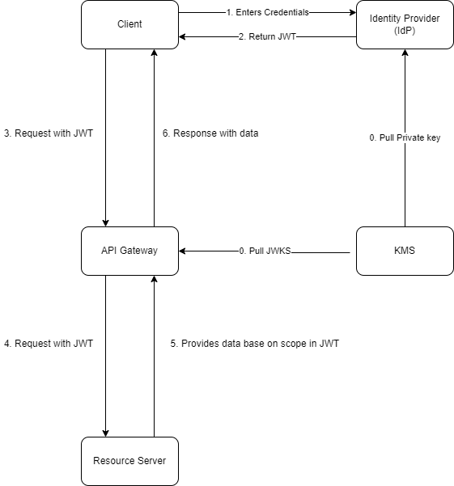

#### IdP (Identity Provider)

[身份验证服务器](https://en.wikipedia.org/wiki/Identity_provider)，包含以下功能：

- 用户认证
- 用户授权
- 授权对象管理

***单个服务还是一组服务？？***

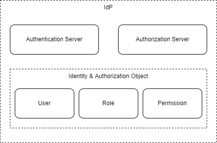

#### KMS

以 [AWS KMS](https://aws.amazon.com/cn/kms/) 为例

- 保护静态数据
- 加密和解密数据
- 签名并验证数字签名
- 使用 HMAC 验证 JSON Web 令牌


#### Resource Server

提供资源服务的服务器，在方案中包含以下职责：

- 集成验证JWT技术实现（基于性能考量，可选）
- 请求数据授权范围校验
- 实现认证协议中的错误响应规范

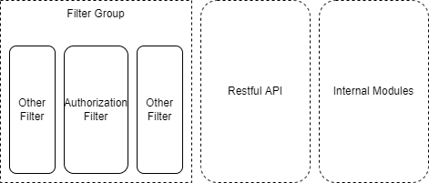

### 认证时序

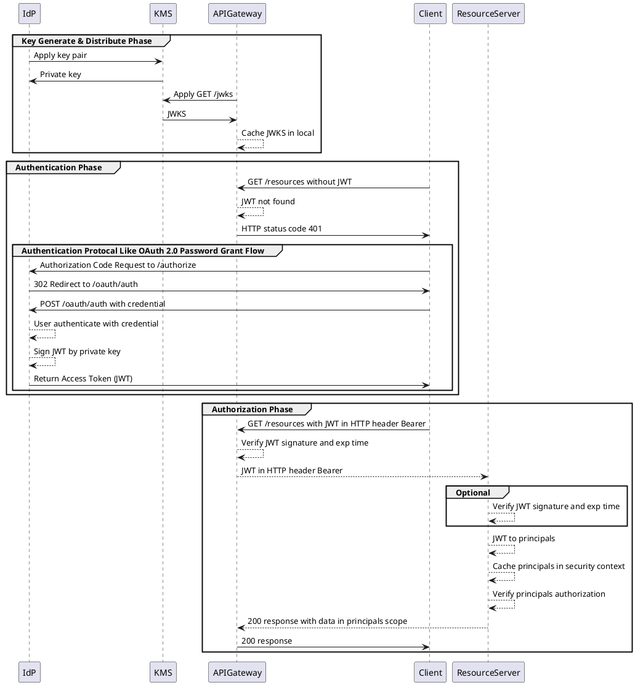

### JWT内容规范

JWT作为访问凭证包含用户必要的认证和授权信息，并且Resource Server在访问时可以选择验证JWT合法性，防止越权访问。

#### Header

| 名称 | 说明                           | 示例                |
| ---- | ------------------------------ | ------------------- |
| typ  | 用于标识JWT的类型，固定为JWT   | JWT                 |
| alg  | 用于标识JWT的算法，固定为HS256 | HS256               |
| kid  | 用于标识JWT的秘钥ID，固定为1   | data-management.pub |

***示例***

```json
{
  "alg": "HS256",
  "typ": "JWT",
  "kid": "data-management.pub"
}
```

#### Payload

| 名称        | 说明                                            | 示例                                 | 备注                                                  |
| ----------- | ----------------------------------------------- | ------------------------------------ | ----------------------------------------------------- |
| iss         | 用于标识JWT的签发者，固定为IdP                  | https://idp.example.com              |                                                       |
| sub         | 用于标识JWT的接收者，固定为Client               | https://client.example.com           | 默认不启用                                            |
| aud         | 用于标识JWT的授权对象，固定为Resource Server    | https://resource.example.com         | 默认不启用                                            |
| exp         | 用于标识JWT的过期时间，以Unix时间戳表示，单位秒 | 1570880000                           | 默认2小时                                             |
| nbf         | 用于标识JWT的生效时间，以Unix时间戳表示，单位秒 | 1570880000                           | 默认不启用                                            |
| iat         | 用于标识JWT的签发时间，以Unix时间戳表示，单位秒 | 1570880000                           | 默认不启用                                            |
| jti         | 用于标识JWT的唯一身份标识，固定为UUID           | ef6d9c0f-c9c0-4e5b-b8c0-f9b9c0f9b9c0 | 当前User ID为数据库自增ID，后续使用唯一性算法生成     |
| roles       | 用于标识JWT的角色集合                           | admin/ops etc.                        |                                                       |
| permissions | 用于标识JWT的权限集合                           | user:create/user:delete etc.       | 不建议携带，会超出JWT（HTTP）长度限制，当前阶段不启用 |

***示例***

```json
{
  "sub": "1234567890",
  "name": "John Doe",
  "iat": 1516239022,
  "exp": 1516239022,
  "roles": ["admin"]
}
```

#### JWT一些限制

- 无状态，难以主动失效，无法实现踢用户下线功能
- 只能携带有限的数据，角色列表可携带，权限列表不建议携带，通过全局Cache管理，提高性能, [HTTP Header Limit](https://stackoverflow.com/questions/686217/maximum-on-http-header-values)

### 业务流程
#### 密钥分发

JWT签发和验签都需要基于非对称密钥进行，密钥如何产生和进行生命周期管理需要一个独立的管理模块或服务来负责。

##### 解决方案

[KMS(Key Management Service)]() + [JWT kid](https://www.rfc-editor.org/rfc/rfc7515#section-4.1.4)

KMS的引入需要帮助我们解决以下几个问题：

- 在系统设计的过程中不能仅使用唯一密钥对作为整个系统所有RPC的OpenAPI认证
- 私钥主动更新或因泄露导致的被动更新是无可避免的

```puml
Client -> ResourceServer : Request with JWT
ResourceServer --> ResourceServer : kid exist in JWT claim
ResourceServer --> ResourceServer : JWKS exist check
alt JWKS not exist
  ResourceServer-->KMS : Get JWKS
  KMS --> ResourceServer : JWKS
end
ResourceServer --> ResourceServer : Select public key from JWKS by kid
ResourceServer-->ResourceServer : Verify JWT
ResourceServer -> Client : Protected data
```

#### JWT生成

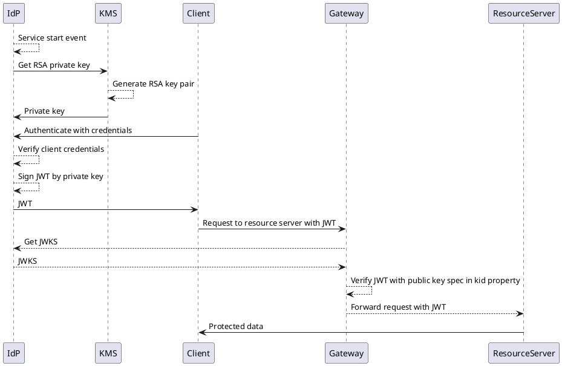

#### JWT验证


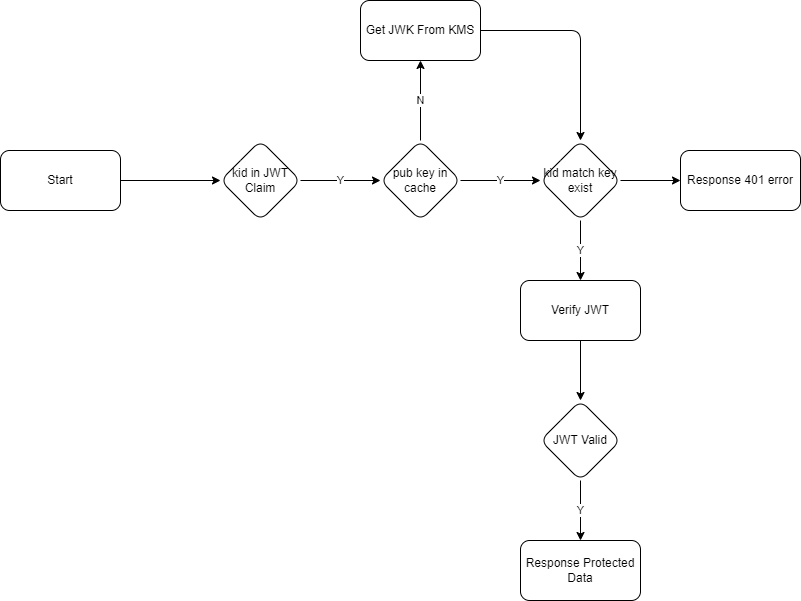

#### 认证授权信息转化

具体业务代码中往往不直接使用JWT作为业务对象进行传递，需要将JWT中的认证和授权信息转换为例如用户、角色、授权等更直观的业务对象，易于理解和在方法之间传递。

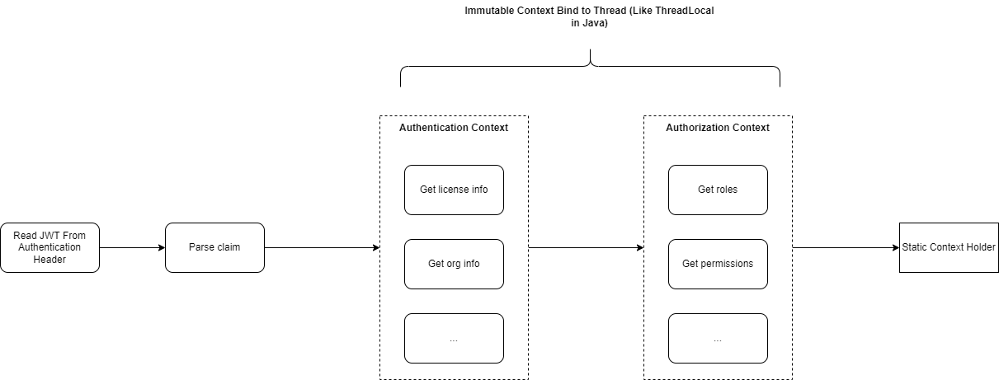

#### JWT Refresh Token
```
  +--------+                                           +---------------+
  |        |--(A)------- Authorization Grant --------->|               |
  |        |                                           |               |
  |        |<-(B)----------- Access Token -------------|               |
  |        |               & Refresh Token             |               |
  |        |                                           |               |
  |        |                            +----------+   |               |
  |        |--(C)---- Access Token ---->|          |   |               |
  |        |                            |          |   |               |
  |        |<-(D)- Protected Resource --| Resource |   | Authorization |
  | Client |                            |  Server  |   |     Server    |
  |        |--(E)---- Access Token ---->|          |   |               |
  |        |                            |          |   |               |
  |        |<-(F)- Invalid Token Error -|          |   |               |
  |        |                            +----------+   |               |
  |        |                                           |               |
  |        |--(G)----------- Refresh Token ----------->|               |
  |        |                                           |               |
  |        |<-(H)----------- Access Token -------------|               |
  +--------+           & Optional Refresh Token        +---------------+
```

参考：https://datatracker.ietf.org/doc/html/rfc6749#page-10

#### 密钥失效

JWT对应的密钥应具备强制失效策略，以应对密钥泄露等风险，KMS可靠性导致的密钥丢失也会触发密钥主动失效的管理需求

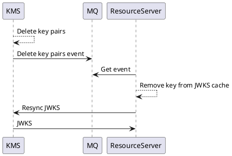
#### 超时策略
暂无具体管理需求输入

### 外部流量请求流程
参考认证时序章节

### 内部流量请求流程
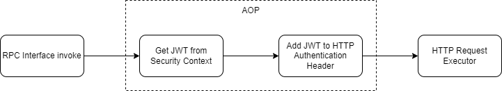

## 技术实现

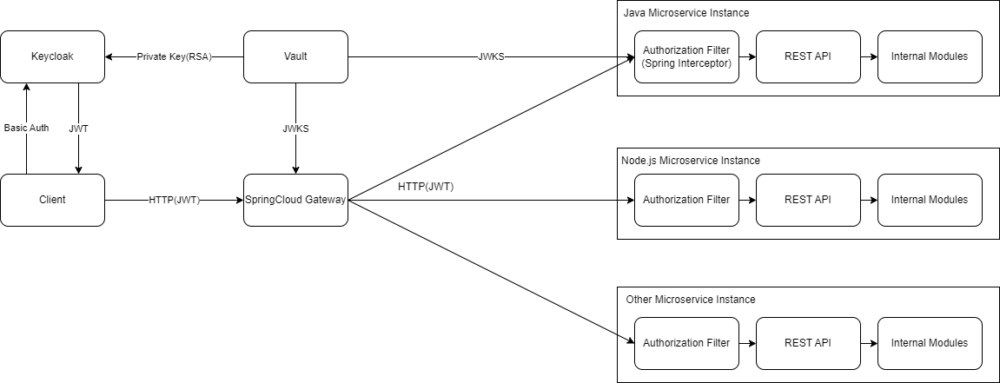

| 组件名称   | 描述                           |
| ---------- | ------------------------------ |
| IdP        | Keycloak |
| KMS        | Vault                          |
| APIGateway | SpringCloud Gateway            |


Sample code in Repository: [basic-framework](https://github.com/kevinpan45/basic-framework/tree/enhance/upgrade-springboot-3x)

### Spring Resource Server with JWT

Reference: [OAuth 2.0 Resource Server JWT](https://docs.spring.io/spring-security/reference/servlet/oauth2/resource-server/jwt.html)

1. Add Spring dependencies

```xml
<!-- Spring Security OAuth 2.0 Resource Server JWT -->
<dependency>
	<groupId>org.springframework.boot</groupId>
	<artifactId>spring-boot-starter-security</artifactId>
</dependency>
<dependency>
	<groupId>org.springframework.security</groupId>
	<artifactId>spring-security-oauth2-resource-server</artifactId>
</dependency>
<dependency>
	<groupId>org.springframework.security</groupId>
	<artifactId>spring-security-oauth2-jose</artifactId>
</dependency>
```

2. Configure JWKS in `application.yml`

```yaml
spring:
  security:
    oauth2:
      resourceserver:
        jwt:
          issuer-uri: https://idp.example.com
          jwk-set-uri: https://idp.example.com/.well-known/jwks.json
```

3. Spring Security Configuration to Enable JWT Validation

```java
@EnableWebSecurity
@Configuration(proxyBeanMethods = false)
public class SecurityConfiguration {
    @Bean
    public SecurityFilterChain securityFilterChain(HttpSecurity http) throws Exception {
        http.authorizeHttpRequests(authorize -> authorize.requestMatchers(EndpointRequest.toAnyEndpoint()).permitAll()
                .anyRequest().authenticated()).oauth2ResourceServer((oauth2) -> oauth2.jwt(Customizer.withDefaults()));
        return http.build();
    }

    @Bean
    public AuthenticationEventPublisher authenticationEventPublisher(
            ApplicationEventPublisher applicationEventPublisher) {
        return new DefaultAuthenticationEventPublisher(applicationEventPublisher);
    }
}
```

### Customise principals with JWT tokens

1. Listen Authenticated Event: `@EventListener public void onSuccess(AuthenticationSuccessEvent success) {}`
2. Get JWT Object: `AuthenticationSuccessEvent.getAuthentication().getPrincipal()`
3. Convert JWT to Customize Entity: `JwtProvider.handle(Jwt jwt)`
4. Add Entity to `ThreadLocal`: `ThreadLocal<T>.set(T)`

### Passing JWT through ThreadLocal and Use in Anywhere

[IamContextHolder.java](https://github.com/kevinpan45/basic-framework/blob/enhance/upgrade-springboot-3x/src/main/java/io/github/kevinpan45/common/iam/context/IamContextHolder.java)


#### RPC Client with JWT
OpenFeign Request Interceptor

```java
public class FeignClientInterceptor implements RequestInterceptor {
    @Override
    public void apply(RequestTemplate template) {
        template.header("Authorization", "Bearer " + IamContextHolder.getContext());
    }
}
```


## 引用

- Subjects Principles Credentials: https://docs.oracle.com/javase/7/docs/technotes/guides/security/jgss/tutorials/glossary.html
- JWKS: https://auth0.com/docs/secure/tokens/json-web-tokens/json-web-key-sets
- JWT kid: https://www.rfc-editor.org/rfc/rfc7515#section-4.1.4
- OAuth 2.0 Simplified: https://www.oauth.com/
- The OAuth 2.0 Authorization Framework: https://datatracker.ietf.org/doc/html/rfc6749
- OAuth2 Authorization Code Grant: https://datatracker.ietf.org/doc/html/rfc6749#section-4.1
- Resource Server: https://www.oauth.com/oauth2-servers/the-resource-server/
- Spring Cloud Gateway for Stateless Microservice Authorization: https://www.youtube.com/watch?v=RRMO4oNptoQ
- IdP: https://www.okta.com/identity-101/why-your-company-needs-an-identity-provider/
- IAM：https://www.cloudflare.com/zh-cn/learning/access-management/what-is-identity-and-access-management/
- Consul API Gateway Overview：https://www.consul.io/docs/api-gateway
- Control Access into the Service Mesh with Consul API Gateway：https://learn.hashicorp.com/tutorials/consul/kubernetes-api-gateway
- Distributed Configuration with Consul：https://cloud.spring.io/spring-cloud-consul/1.3.x/multi/multi_spring-cloud-consul-config.html
- Spring Cloud Refresh Scope：https://cloud.spring.io/spring-cloud-static/Greenwich.SR2/multi/multi__spring_cloud_context_application_context_services.html#refresh-scope